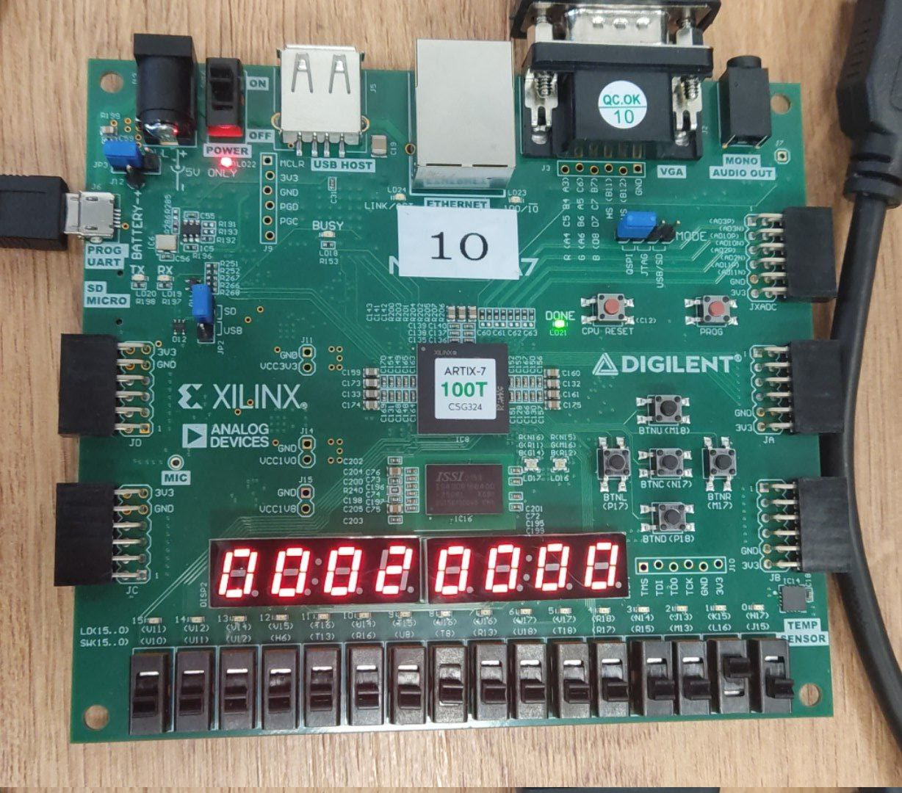

# SystemVerilog and FPGA Sber hackathon

- We are team Spirt:
    - [Kasparov Nikolay](https://github.com/nniikon)
    - [Naumov Vladimir](https://github.com/fogInSingularity)
    - [Rozhkov Alexander](https://github.com/ralex2304)
- 2nd place
- November 2024, MIPT

## ADHD game

### Idea

Attention is priceless resource in modern world. Game developers use different techniques to attract it, even for just a few seconds.

So we've made a game that combines two exciting activities in one! A double portion of pleasure

### Left half of the screen - keep the ball in safe zones

Firstly, random level generation happens. Probability of each cell to be safe zone depends on near cells. So, solid areas are generated.

Player controls ball by tilting devboard. Each level lasts for certain amount of time: game becomes faster with each level.

Gamer must place ball to the safe zone by the end of the level.

### Right half - dodge oncoming obstacles

In this game obstacles are also generated randomly. Player uses devboard buttons as controls. This game doesn't have levels, it lasts as long as first game.

## Tech equipment and used features

We had Xilinx Artix 7 series development board and used these features:

- SVGA for video output
- accelerometer as left game controller
- buttons for right game
- switches for color scheme control and pausing
- quad displays for timer and score demonstration
- RGB LEDs as game state indicators

Also we used Xilinx IP ROM for game state banners and RAM as level map storage

## Software

- `Verilator` + `SDL2` lib - simulation
- `Xilinx Vivado` - dev suite for Xilinx boards
